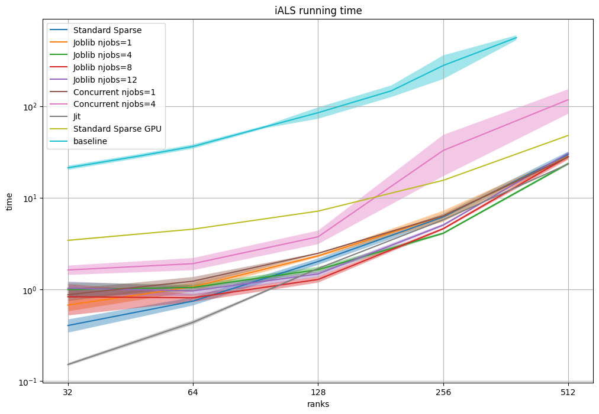

# Comparison of Several Implementations for iALS (Rendle 2021) 

There experiment compare several implementations for implicit feedback Alternating Least Squares (iALS). All of them adopt the matrix factorization approach (not SDG) and exploit the sparsity of the user/item interaction matrix. 

## Requirements: 
* `numpy`
* `pandas`
* `cupy`
* `scipy`
* `matplotlib`
* `tqdm `
* `joblib`
* `concurrent`
* `numba`
* `cupy` (CUDA support is needed)

## Dataset and Evaluation
I used MovieLens-1M dataset. I used a sampled evaluation metric, HR@10 in a sample of size 100 (target item against 99 negative samples). 

## Reproduction of iALS (Rendle 2021) results
The benchmarks `/baseline_logs` were recorded for the code available in [https://github.com/google-research/google-research/tree/master/ials/]. I stored results separately as they take too long and they run using python2.

## Results
* Jitted and standard version are best for lower ranks.
* Joblib is devoted for embarrassingly parallel jobs, it's the best when rank get larger.
* We can extrapolate curves to predict that GPU version will be the best for suffeciently large ranks, but it's not needed for this small dataset.

